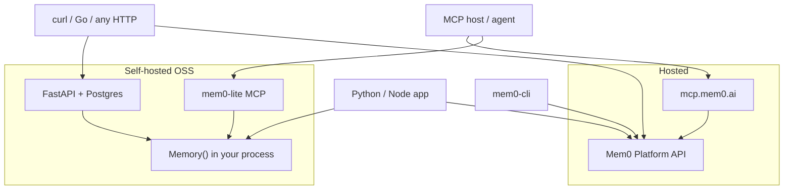
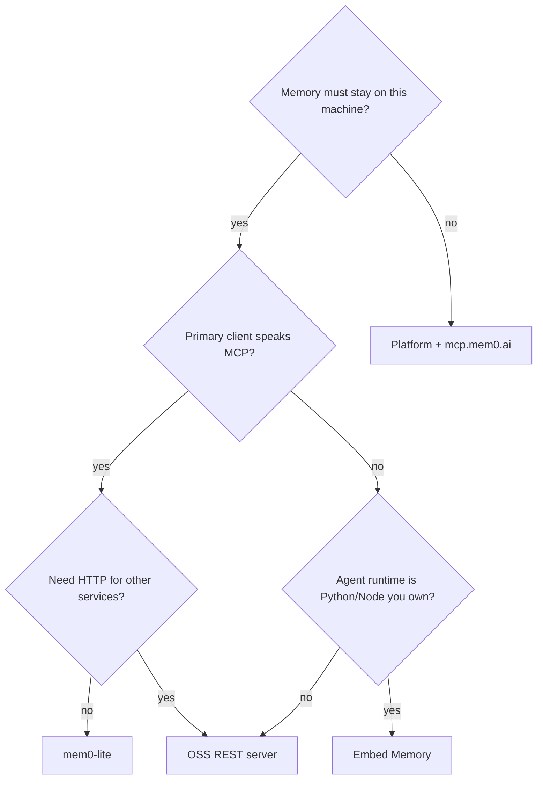

# Alternative Mem0 architectures

Mem0 ships several products that share a name and a method surface (`add` / `search` / `get` / …) but not a deployment model. Pick by who owns the process and which protocol the client already speaks.



## Comparison

| | Platform | OSS REST (`server/`) | OSS SDK in-process | mem0-lite |
|---|---|---|---|---|
| Data location | Mem0 cloud | Your Postgres | Local Qdrant/SQLite | Local Qdrant/SQLite |
| Always-on cost | None local | Docker VM + Postgres, or uvicorn + Postgres | None | MCP sidecar while the host is open |
| stdio MCP? | Yes (hosted MCP) | No (shell + curl) | No | Yes (stdio MCP) |
| Agent hot path | HTTP to cloud | HTTP to localhost | Direct calls | MCP → in-process `Memory()` |
| Auth | API key / OAuth | JWT / `X-API-Key` | None | None |
| Dashboard | Yes | Yes | No | No |
| Official CLI | Yes | Paths/auth mismatch | No | No |
| Docker required | No | Intended path | No | No |

## Platform + hosted MCP

**Use when** you want zero local infra and are fine with memory off-box.

Hosted MCP config points at `https://mcp.mem0.ai/mcp/` with `Authorization: Token …`. Official `mem0-cli` talks to `api.mem0.ai` (`/v3/memories/add/`, `Authorization: Token`). That CLI is a Platform client even if you set `MEM0_BASE_URL`.

**Do not** point `MEM0_BASE_URL` at the OSS server and expect it to work. OSS exposes `POST /memories` and `X-API-Key`. Different contract.

## OSS REST server

**Use when** several languages or services need one HTTP API, you want the dashboard, or the MCP host is not the only client.

Compose runs FastAPI, pgvector, and a Next dashboard. Auth is on by default. This is a real service: migrations, JWT, API keys, request log.

Cost on a laptop: Docker Desktop’s VM plus Postgres, even when idle. Fine on AC; a poor always-on battery choice.

There is no first-class non-Docker path in-tree. Native Postgres + uvicorn is possible and unofficial.

## OSS SDK in-process

**Use when** the agent runtime is Python (or Node with `mem0ai/oss`) and you control process lifetime.

```python
memory = Memory.from_config(config)  # once
memory.add(...)
memory.search(..., filters={"user_id": "..."})
```

This is the lowest overhead *if* you already have a long-lived interpreter. A hosted coding agent is not that interpreter. Embedding `Memory()` inside the agent loop is not an available API.

A Python CLI that constructs `Memory()` on every `uv run` / shebang invoke is this architecture with the worst lifecycle: import tax on every add.

## mem0-lite (this repo)

**Use when** the primary client is an MCP host, you want OSS data on disk, and you refuse Docker. Setup: [README Install](../README.md#install).

MCP is not “better than REST.” It is the protocol the host already multiplexes. The server is a thin FastMCP façade over the same `Memory()` you would embed in a Python agent.

If you later need HTTP for non-MCP clients, add a REST daemon and keep this MCP server as an adapter — or drop MCP and accept shell+curl from the host. Do not run both without a reason.

## Official CLIs

`mem0-cli` (Python) and `@mem0/cli` (Node) are Platform-only. `get_backend()` returns `PlatformBackend`. The `[oss]` extra installs `mem0ai`; it does not wire a local backend.

Treat them as human/ops tools against `api.mem0.ai`, not as the agent memory plane.

## Decision sketch


