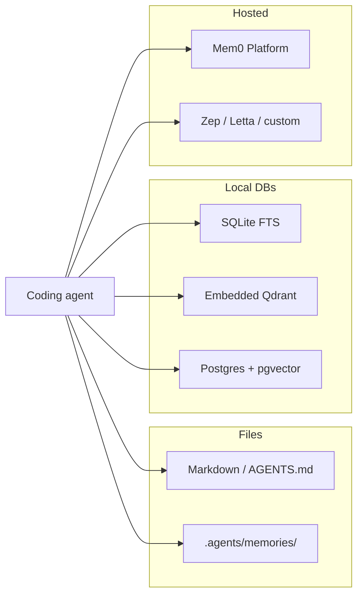
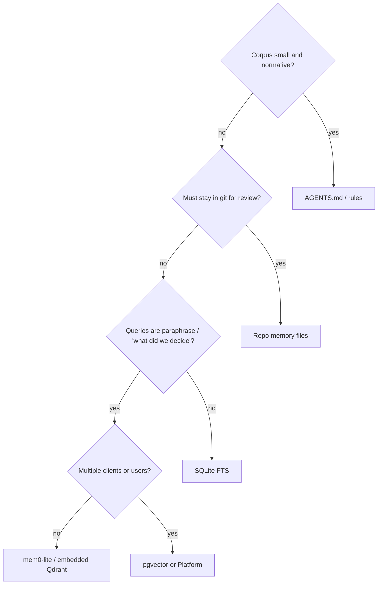

# Alternative memory-storage approaches

Mem0 is one way to persist agent memory. It is not the only one, and it is a poor fit if you do not want an LLM in the write path or a vector index in the read path.

## 1. Prompt files (AGENTS.md, CLAUDE.md, rules)

**What:** Durable facts live in git as markdown the host injects every turn.

**Strengths:** Diffable, reviewable, zero runtime, works offline, no API key.

**Weaknesses:** Unbounded growth pollutes the system prompt. No semantic retrieval. Humans (or agents) must edit by hand. Conflicts are merge conflicts, which is a feature and a chore.

**Use when** the corpus is small and normative: “never force-push main,” “pnpm only.” mem0-lite’s [AGENTS.md pointer](../README.md#thin-agentsmd) is this layer for *when* to recall/capture; Mem0 is for *volume* that should not occupy the prompt.

## 2. Thread / project memory files

Example: thread-memory skills (e.g. under `.agents/memories/`) — glossary plus per-thread files with settled decisions, rejected options, footguns.

**Strengths:** Scoped to a repo and a thread. Survives model swaps. Easy to grep. No embedding pipeline.

**Weaknesses:** Retrieval is “read Meta, then matching bodies,” not k-NN. Cross-repo recall does not exist unless you copy files. Agents over-write if the protocol is sloppy.

**Use when** memory is *this engagement’s* decisions, not “who is the user” or “how we deploy service X in general.” Complementary to mem0-lite: files for the current workstream, Mem0 for cross-session identity and standing rules.

## 3. SQLite (or Postgres) without vectors

Store facts as rows; search with `LIKE` / FTS5.

**Strengths:** Operationally boring. Transactions. Easy backup. No embedding drift when you change models.

**Weaknesses:** “What did we decide about auth?” is a semantic question. FTS fails on paraphrase. You will reinvent ranking.

**Use when** writes are structured (`key`, `value`, `project_id`) and queries are exact. A personal wiki in SQLite beats Mem0 for “API token *name* is `FOO`” if you never want an LLM to rewrite it.

## 4. Embedded vector store (this repo)

mem0ai defaults to local Qdrant + SQLite history. Embeddings from OpenAI (or Ollama). Search is cosine similarity over extracted facts.

**Strengths:** Paraphrase recall. Agent-shaped API. Extraction can collapse a transcript into facts (`infer=true`) or store verbatim (`infer=false`).

**Weaknesses:** Write path often calls an LLM (unless `infer=false` *and* you still pay for embeddings). Index format is not a git-friendly artifact. Changing embedder invalidates the collection unless you re-index.

**Use when** you want semantic recall of many small facts across sessions, on one machine.

## 5. Server-side pgvector / Qdrant / whatever

OSS Mem0 REST and many “memory layers” put vectors in a real database.

**Strengths:** Multi-client, backups, RBAC if you add it, one writer service.

**Weaknesses:** You are running a database. On a laptop that usually means Docker.

**Use when** more than one process or user must share memory, or you already operate Postgres.

## 6. Hosted memory products

Mem0 Platform, Zep, Letta, provider-native “memory” toggles.

**Strengths:** No local store. Multi-device. Dashboard. Someone else handles extraction quality.

**Weaknesses:** Data residency. Product lock-in. Cost at agent-loop volume. Debugging retrieval means reading someone else’s traces.

**Use when** residency is acceptable and you do not want to own the index.

## 7. Fine-tune / context distillation

Periodically summarize the session into a single “memory pack” and stuff it into the next system prompt.

**Strengths:** Trivial. No extra service.

**Weaknesses:** Lossy, recency-biased, no point lookup, no typed facts (`decision` vs `anti_pattern`). Does not scale past a few kilobytes of remembered material.

## How to choose

mem0-lite occupies the **single-user, semantic, on-disk** cell. If you outgrow it, you did not pick the wrong abstraction — you picked a different deployment of the same `Memory()` API (REST + Postgres) or you left Mem0 for files.
