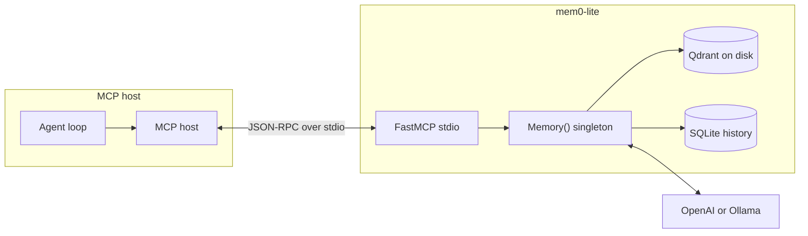
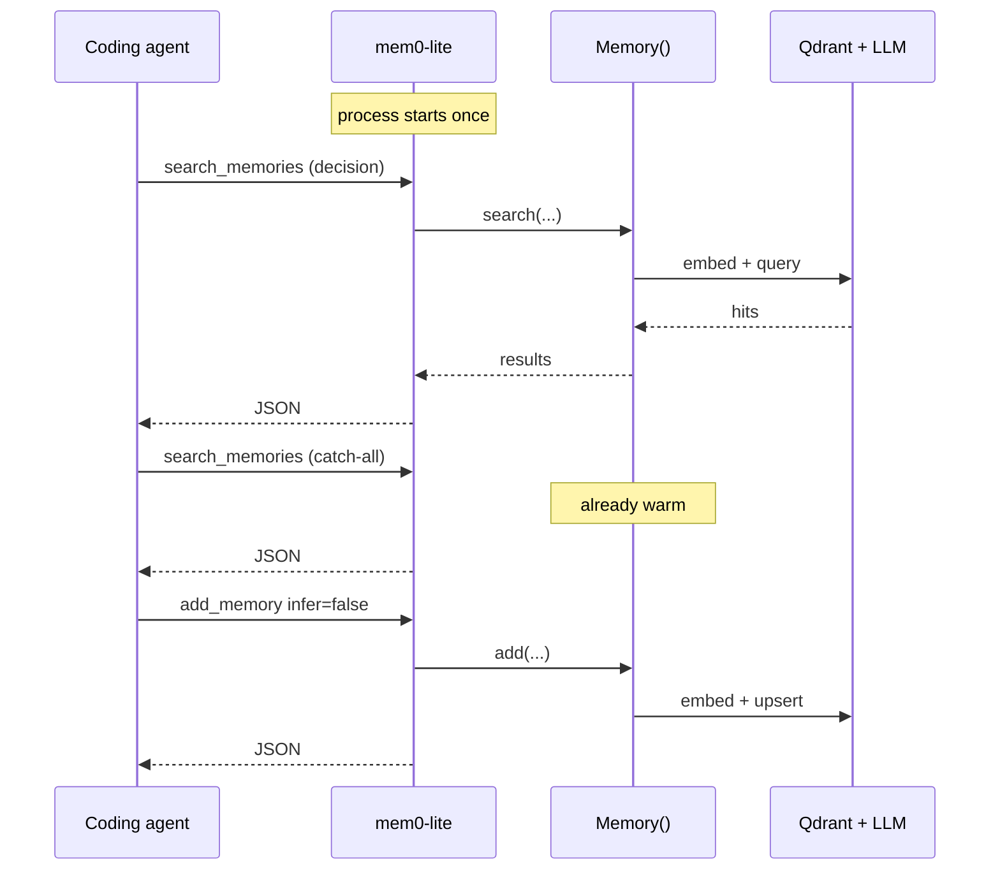
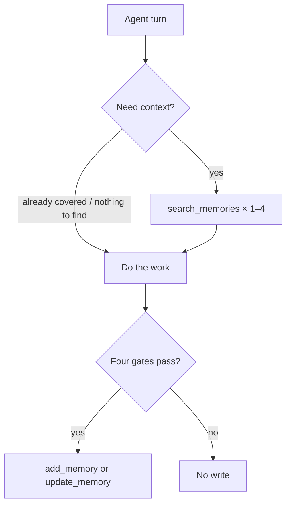

# Architecture

mem0-lite is a **stdio MCP server** that wraps OSS `mem0ai.Memory()`. The MCP host launches one process per session. That process owns the vector store connection. Subsequent tool calls reuse it.



## Why this process model

Coding agents issue several memory calls in a row (search × 2–4 at task start, then maybe an add). Spawning Python + importing `mem0ai` per call is the cost you feel. A REST daemon would also stay warm, but MCP hosts speak MCP, not REST. Putting `Memory()` inside the MCP process removes both the HTTP hop and the per-call interpreter. Two sidecars on one `MEM0_DIR` take turns via yield, not a second Qdrant/mem0 process ([D10](decisions.md#d10--keep-open-embedded-qdrant--cooperative-yield-no-store-daemon)).



## Layout

```
mem0-lite/
├── README.md             # install: MCP snippet + thin AGENTS.md
├── plugins/              # bundled plugin source (git/, …)
├── mem0_lite/            # package: core, mcp, cli, plugin framework
│   ├── core.py           # Memory() + store lock/yield
│   ├── mcp.py            # FastMCP tools
│   ├── scope.py          # project/workstream/scope helpers
│   ├── context.py        # plugin probe/stamp/recall glue
│   ├── cli.py            # mem0-lite mcp
│   └── plugins/          # ContextPlugin protocol, loader, runner
├── pyproject.toml        # uv project
└── docs/
```

## Runtime

| Piece | Default | Override |
|---|---|---|
| Transport | stdio | none (primary path) |
| Data dir | `~/.mem0/` — `qdrant/`, `history.db`, `config.json`, `lite.lock`, `lite.want`, `access-log.jsonl`, `feedback.jsonl` | `MEM0_DIR` |
| Store lock | holder keeps Qdrant + `lite.lock`; waiter writes `lite.want` then blocks | `MEM0_LITE_LOCK_TIMEOUT` (seconds, default 30) |
| LLM | OpenAI `gpt-5-mini` via mem0ai defaults | `MEM0_LITE_LLM_PROVIDER` / `MEM0_LITE_LLM_MODEL` |
| Embedder | OpenAI `text-embedding-3-small` | `MEM0_LITE_EMBEDDER_PROVIDER` / `MEM0_LITE_EMBEDDER_MODEL` |
| User scope | `$MEM0_LITE_USER_ID` or `$USER` | tool arg `user_id` |
| Agent scope | `$MEM0_LITE_AGENT_ID` if set | tool arg `agent_id` |
| Feedback mode | off (no `ts` on responses) | `MEM0_LITE_FEEDBACK_MODE=1` adds `ts` for `rate_memory_call` |
| Plugins | `$MEM0_DIR/plugins/<name>/` (default `~/.mem0/plugins/`) when present | `MEM0_LITE_PLUGINS_DISABLE`; `just setup` symlinks repo `plugins/` |
| Git confinement | cwd must sit in its toplevel; `/` refused | `MEM0_LITE_GIT_ROOTS` (pathsep) |
| Git fetch / gh / promote | off | `MEM0_LITE_GIT_FETCH`, `MEM0_LITE_GIT_GH`, `MEM0_LITE_GIT_PROMOTE` |

The holder keeps `Memory()` open and holds `lite.lock`. Another MCP on the same `MEM0_DIR` writes `lite.want`; the holder yields after the current op (or while idle). Embedded Qdrant cannot share a folder (`qdrant/.lock` for the client lifetime). We do not run a Qdrant/mem0 daemon for that sharing — Cursor already keeps this sidecar alive ([D10](decisions.md#d10--keep-open-embedded-qdrant--cooperative-yield-no-store-daemon)). Timeout returns `{"error": "store_busy"}`.

## Tools

OSS `Memory()`, not the Platform HTTP surface. Paths like `/v3/memories/add/` do not exist here.

| Tool | SDK call | Notes |
|---|---|---|
| `add_memory` | `add(..., infer=False)` | `memory_type` → `metadata.type`; optional `project`/`repo`, `workstream`, `source_ref`, `scope`, `cwd` |
| `search_memories` | `search(..., filters={user_id, …})` | 3–6 keywords; optional parallel `decision` / `convention` / `anti_pattern`; default OR when `project` known |
| `get_memory_by_id` | `get(id)` | |
| `list_memories` | `get_all(...)` | not a search; same optional project filters as search |
| `update_memory` | `update(id, text=…, metadata=…)` | prefer over delete+add; `metadata_json` patches tags |
| `delete_memory` | `delete(id)` | |
| `delete_all_memories` | `delete_all(...)` | requires `confirm=true` |
| `rate_memory_call` | append `feedback.jsonl` | rates a prior retrieval by `call_ts`; no store access |

`search` / `get_all` take filters as a dict (`user_id`, optional `agent_id`, optional `type`). They reject top-level `user_id=` kwargs; the wrapper maps that correctly.

## Project / workstream / scope

Metadata keys (same payload flattening as `type`):

- `project` — identity for standing facts (not a local path). `repo` is a tool-arg alias.
- `workstream` — current unit of work
- `source_ref` — opaque provenance for plugins (git stores the branch name)
- `scope` — `standing` \| `wip` \| `historical`

Untagged memories stay valid. Default recall when `project` is known and the agent omitted `scope`/`workstream`:

- `scope=standing` AND `project=<current>`
- OR `scope=wip` AND `workstream=<current>` AND `project=<current>`

Otherwise search is the whole user bucket. Explicit filters are not overridden.

`cwd` is a working-directory hint. Core does not assume git. The bundled git plugin stamps tags from an allowlisted snapshot ([D11](decisions.md#d11--bundled-git-is-an-allowlisted-probe-not-a-shell)). Fetch / `gh` / auto-promote stay env-gated. Search/list may include one `follow_up` and a structured `warning`.

## Plugins

Auto-load `ContextPlugin` classes only from `$MEM0_DIR/plugins/<name>/` (default `~/.mem0/plugins/<name>/`) when that tree exists ([D12](decisions.md#d12--plugins-are-operator-code-not-a-sandbox)). Bundled source lives in repo `plugins/<name>/`; `just setup` symlinks it into the data dir. Each plugin is a subdirectory with `plugin.py` or `__init__.py`; loose files at the plugins root are ignored. Never from the agent workspace. A plugin is code in this process. The core runner lists WIP and applies `PromoteOp` updates inside `memory_session()`; plugin I/O runs outside the lock.

## Protocol vs runtime

The server stores and retrieves. It does not decide *when* to remember. That lives in a thin [AGENTS.md pointer](../README.md#agentsmd). *How* (query rewrite, `infer=false`, types) lives on the tool docstrings.



## Boundaries

- One machine, one user is the design point. There is no auth layer.
- Concurrency is “one MCP session,” not a multi-worker API.
- Graph memory, Platform entities, and async event IDs are out of scope.
