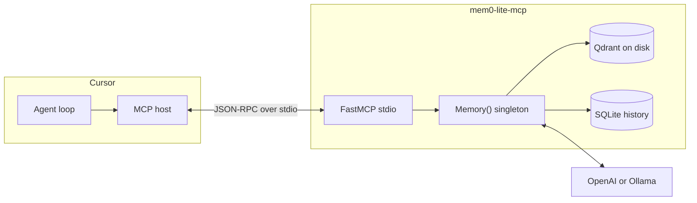
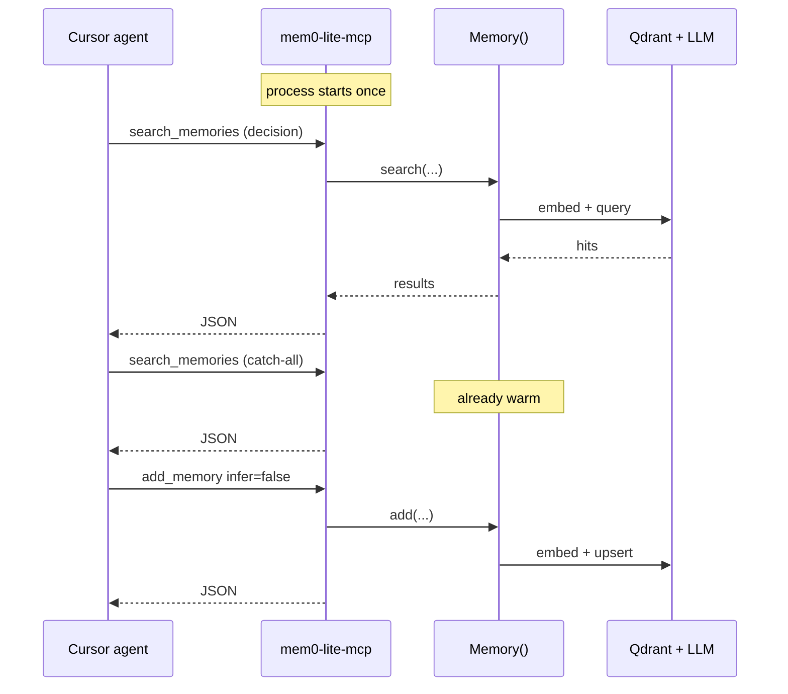
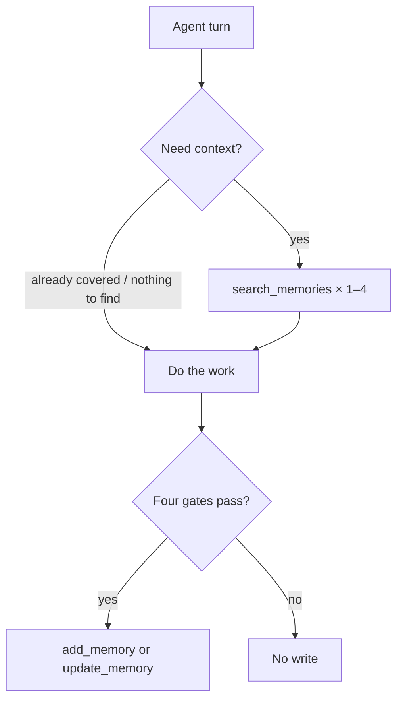

# Architecture

mem0-lite is a **stdio MCP server** that wraps OSS `mem0ai.Memory()`. Cursor launches one process per session. That process owns the vector store connection. Subsequent tool calls reuse it.



## Why this process model

Coding agents issue several memory calls in a row (search × 2–4 at task start, then maybe an add). Spawning Python + importing `mem0ai` per call is the cost you feel. A REST daemon would also stay warm, but Cursor does not speak REST natively; it speaks MCP. Putting `Memory()` inside the MCP process removes both the HTTP hop and the per-call interpreter.



## Layout

```
mem0-lite/
├── mcp.json              # Cursor MCP registration (template)
├── mem0-attach.md        # paste into AGENTS.md
├── mcp/                  # uv project
│   ├── pyproject.toml
│   └── src/mem0_lite_mcp/
│       ├── server.py     # FastMCP tools
│       ├── memory.py     # lazy Memory() + env config
│       └── serialize.py
└── docs/
```

## Runtime

| Piece | Default | Override |
|---|---|---|
| Transport | stdio | none (this is the Cursor path) |
| Vectors | `~/.mem0-lite/qdrant` | `MEM0_LITE_DATA_DIR` |
| History | `~/.mem0/history.db` (mem0ai default) | mem0ai config; not re-homed yet |
| LLM | OpenAI `gpt-5-mini` via mem0ai defaults | `MEM0_LITE_LLM_PROVIDER` / `MEM0_LITE_LLM_MODEL` |
| Embedder | OpenAI `text-embedding-3-small` | `MEM0_LITE_EMBEDDER_PROVIDER` / `MEM0_LITE_EMBEDDER_MODEL` |
| User scope | `$MEM0_LITE_USER_ID` or `$USER` | tool arg `user_id` |
| Agent scope | `$MEM0_LITE_AGENT_ID` if set | tool arg `agent_id` |

`Memory()` is constructed on first tool call, behind a lock. Later calls reuse the same instance.

## Tools

OSS `Memory()`, not the Platform HTTP surface. Paths like `/v3/memories/add/` do not exist here.

| Tool | SDK call | Notes |
|---|---|---|
| `add_memory` | `add(..., infer=False)` | `memory_type` becomes `metadata.type` |
| `search_memories` | `search(..., filters={user_id, …})` | keyword-style queries; see attach snippet |
| `get_memory_by_id` | `get(id)` | |
| `list_memories` | `get_all(...)` | not a search |
| `update_memory` | `update(id, text=…)` | prefer over delete+add |
| `delete_memory` | `delete(id)` | |
| `delete_all_memories` | `delete_all(...)` | requires `confirm=true` |

`search` / `get_all` take filters as a dict (`user_id`, optional `agent_id`, optional `type`). They reject top-level `user_id=` kwargs; the wrapper maps that correctly.

## Protocol vs runtime

The server stores and retrieves. It does not decide *when* to remember. That lives in [`mem0-attach.md`](../mem0-attach.md): recall on task start, four gates before write, `infer=false`, third-person facts.



## Boundaries

- One machine, one user is the design point. There is no auth layer.
- Concurrency is “Cursor’s MCP session,” not a multi-worker API.
- Graph memory, Platform entities, and async event IDs are out of scope.
