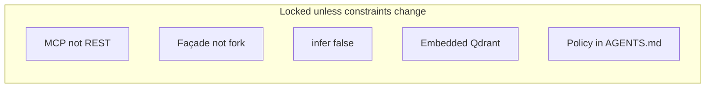

# Major decisions

Recorded so the next pass does not re-litigate them without new constraints.

## D1 — MCP sidecar, not REST daemon

**Choice:** FastMCP over stdio wrapping `Memory()`.

**Why:** Cursor’s agent multiplexes MCP tools with schemas. A REST daemon is the right *service* shape for curl/Go; it is the wrong *Cursor* shape unless you add an MCP adapter anyway. One process, one protocol.

**Revisit when:** a second non-MCP client needs the same store. Then add HTTP in front of the same singleton, or run OSS `server/`.

## D2 — Embed `Memory()`, do not reimplement Mem0

**Choice:** `mem0ai` as the runtime. This repo is a façade.

**Why:** Extraction, dedup, embeddings, and Qdrant wiring already exist. A Go/Swift CLI talking HTTP still needs that runtime somewhere. Avoiding Python *in the CLI binary* does not avoid Python *in the system* for OSS Mem0.

**Revisit when:** there is a maintained native OSS port, or you drop Mem0 for files/SQLite.

## D3 — `infer=false` by default on `add_memory`

**Choice:** The agent extracts facts; Mem0 stores them.

**Why:** Double extraction (model writes a fact, Mem0’s LLM extracts again) produces drift, extra latency, and extra cost. The attach protocol already requires self-contained third-person sentences. Official plugin skills use `infer=False` for `/remember` for the same reason.

**Revisit when:** you want “dump this transcript” and trust Mem0’s extractor. Pass `infer=true` per call; do not flip the default without changing `mem0-attach.md`.

## D4 — No Docker, no Postgres

**Choice:** Embedded Qdrant on disk under `~/.mem0-lite/qdrant`.

**Why:** The original constraint was macOS, no Compose, acceptable Python only as a Cursor-managed sidecar. Postgres is correct for multi-tenant REST; it is surplus for one user and one editor.

**Revisit when:** you need concurrent writers, remote clients, or backups that are not “copy this directory.”

## D5 — Agent protocol lives in markdown, not in the server

**Choice:** [`mem0-attach.md`](../mem0-attach.md) for gates, query rewrite, and types. The server does not refuse “small talk” writes.

**Why:** Policy that belongs in the model’s loop will be ignored if it is only a docstring. Putting it in `AGENTS.md` matches how Cursor loads standing instructions. The server stays a dumb store with a confirm flag on bulk delete.

**Revisit when:** you want server-side secret scanning. That is worth code, not a prompt.

## D6 — Types as `metadata.type`, not Mem0 `memory_type`

**Choice:** `decision` | `convention` | `anti_pattern` | … on metadata. SDK `memory_type` is reserved for `procedural_memory`.

**Why:** Passing those strings as `memory_type=` raises in OSS. Plugin skills already classify via metadata.

## D7 — uv, not pip / poetry

**Choice:** `uv run --directory … mem0-lite-mcp` as the MCP `command`.

**Why:** Cursor needs a reproducible launch line. `uv` creates the venv from the lockfile; no global `mem0ai`. Pin `mcp>=1.9,<2` because v2 renames the server class.

## D8 — Placeholder `mcp.json` in-repo, real keys out of band

**Choice:** Ship `mcp.json` with `sk-...`. Document that a real key must not be committed.

**Why:** Copy-paste onboarding. The file is useless as a secret store.

**Revisit when:** Cursor grows a first-class “env from keychain” story you actually use.

## D9 — Not wrapping Platform paths

**Choice:** OSS method names and filter dicts only.

**Why:** Pretending to be `api.mem0.ai` would imply JWT, `/v3/`, and entity APIs this process does not implement. Clients that need Platform should use Platform.

