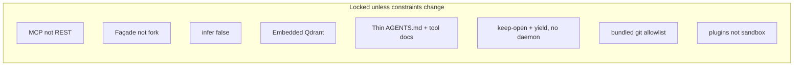

# Major decisions

Recorded so the next pass does not re-litigate them without new constraints.

## D1 — MCP sidecar, not REST daemon

**Choice:** FastMCP over stdio wrapping `Memory()`.

**Why:** MCP hosts multiplex tools with schemas. A REST daemon is the right *service* shape for curl/Go; it is the wrong *MCP* shape unless you add an MCP adapter anyway. One process, one protocol.

**Revisit when:** a second non-MCP client needs the same store. Then add HTTP in front of the same singleton, or run OSS `server/`.

## D2 — Embed `Memory()`, do not reimplement Mem0

**Choice:** `mem0ai` as the runtime. This repo is a façade.

**Why:** Extraction, dedup, embeddings, and Qdrant wiring already exist. A Go/Swift CLI talking HTTP still needs that runtime somewhere. Avoiding Python *in the CLI binary* does not avoid Python *in the system* for OSS Mem0.

**Revisit when:** there is a maintained native OSS port, or you drop Mem0 for files/SQLite.

## D3 — `infer=false` by default on `add_memory`

**Choice:** The agent extracts facts; Mem0 stores them.

**Why:** Double extraction (model writes a fact, Mem0’s LLM extracts again) produces drift, extra latency, and extra cost. The attach protocol already requires self-contained third-person sentences. Official plugin skills use `infer=False` for `/remember` for the same reason.

**Revisit when:** you want “dump this transcript” and trust Mem0’s extractor. Pass `infer=true` per call; do not flip the default without changing the `add_memory` tool docstring.

## D4 — No Docker, no Postgres

**Choice:** Embedded Qdrant on disk under `~/.mem0/qdrant` (same dir as mem0ai `history.db` and `config.json`).

**Why:** The original constraint was macOS, no Compose, acceptable Python only as an MCP-managed sidecar. Postgres is correct for multi-tenant REST; it is surplus for one user and one editor.

**Revisit when:** remote clients, or backups that are not “copy this directory.” Two local MCP processes on one `MEM0_DIR` take turns via `lite.lock` / `lite.want` (D10) — not a Qdrant server.

## D5 — When lives in thin AGENTS.md; how lives on the tools

**Choice:** [Thin AGENTS.md](../README.md#agentsmd) for *when* to search/capture. Tool docstrings for *how* (query rewrite, `infer=false`, types). No skill. The server does not refuse “small talk” writes.

**Why:** MCP schemas already load with the tools. A skill that restates them is duplicate context. Tool docs never say “search at task start”; that *when* belongs in standing instructions. A skill is worse at always-on policy (description match / opt-in).

**Revisit when:** you want server-side secret scanning. That is worth code, not a prompt. Default recall is partly server-side when `project` is known (explicit or via a plugin/`cwd`) — that does not move *when to search* into the server.

## D6 — Types as `metadata.type`, not Mem0 `memory_type`

**Choice:** `decision` | `convention` | `anti_pattern` | … on metadata. SDK `memory_type` is reserved for `procedural_memory`.

**Why:** Passing those strings as `memory_type=` raises in OSS. Plugin skills already classify via metadata.

## D7 — uv, not pip / poetry

**Choice:** `uv run --directory … mem0-lite mcp` as the MCP `command`.

**Why:** MCP hosts need a reproducible launch line. `uv` creates the venv from the lockfile; no global `mem0ai`. Pin `mcp>=1.9,<2` because v2 renames the server class.

## D8 — Placeholder MCP snippet in README, real keys out of band

**Choice:** Ship the MCP snippet in [README Install](../README.md#mcp-registration) with `sk-...`. Document that a real key must not be committed.

**Why:** Copy-paste onboarding. A standalone config file is useless as a secret store and easy to commit by mistake.

**Revisit when:** your host grows a first-class “env from keychain” story you actually use.

## D9 — Not wrapping Platform paths

**Choice:** OSS method names and filter dicts only.

**Why:** Pretending to be `api.mem0.ai` would imply JWT, `/v3/`, and entity APIs this process does not implement. Clients that need Platform should use Platform.

## D10 — Keep-open embedded Qdrant + cooperative yield (no store daemon)

**Choice:** Embedded `QdrantClient(path=...)` under `MEM0_DIR`. The holder keeps `Memory()` open and holds `lite.lock`. A waiter writes `lite.want` (pid), then blocks on `lite.lock` (`MEM0_LITE_LOCK_TIMEOUT`, default 30s → `store_busy`). After the current op — or while idle — the holder closes Qdrant and drops the lock. Never mid-op. The waiter becomes the new holder. Same exclusive lock for reads. In-process threads take `threading.Lock` (flock is per-process). Flock releases on process death; stale `lite.want` is ignored if the pid is dead.

Not a Qdrant server. Not a mem0 REST daemon that MCP processes talk to.

**Why:** Embedded Qdrant exclusive-locks `qdrant/.lock` for the client lifetime; a second opener fails. Close-after-every-call lets two stdio MCP processes take turns, but reloads every vector on every tool call (tens–hundreds of ms as the collection grows). Keep-open is ~0 ms extra on the sidecar hot path. Yield (`lite.lock` + `lite.want`) is how two Cursor MCP processes share one `MEM0_DIR` without a second long-lived process.

Official sharing is a Qdrant server (or mem0 REST) that many clients talk to. We refuse that. This repo’s pitch is no Docker, no Platform, no REST daemon. Cursor already keeps the MCP sidecar alive; a store daemon would be another service to start, health-check, and leave running — the process model we already rejected in D1, applied to the disk store.

**Revisit when:** you need concurrent readers (run Qdrant as a server), or a non-MCP client (HTTP in front of the same singleton — D1). Yield wedges waiters.

## D11 — Bundled git is an allowlisted probe, not a shell

**Choice:** The shipped git plugin runs a frozen argv list via `subprocess` (no `shell=True`, no user argv). Hot path (~2s) is local only: toplevel, origin, branch, status, default-branch verify. `git fetch`, `gh`, and auto-promote are env-gated and default off (`MEM0_LITE_GIT_FETCH`, `MEM0_LITE_GIT_GH`, `MEM0_LITE_GIT_PROMOTE`). Prompts disabled (`GIT_TERMINAL_PROMPT=0`, `GH_PROMPT_DISABLED=1`). Auth failures are skipped, not retried. Official plugin never persists git/gh/status output as memories and never allowlists `git diff` or writes besides fetch updating remote-tracking refs.

**Why:** Agents forget to pass `project`. A checkout is a high-signal stamp for coding workflows. Network and store mutation on the search path are the sharp edges; they stay opt-in. `follow_up` plus `update_memory` is the default promote path.

**Revisit when:** a second bundled probe needs the same confinement helpers.

## D12 — Plugins are operator code, not a sandbox

**Choice:** Auto-load `ContextPlugin` classes only from `$MEM0_DIR/plugins/<name>/` (default `~/.mem0/plugins/<name>/` when that tree exists). Bundled implementations ship in repo `plugins/<name>/`; `just setup` symlinks them into the data dir. Each plugin is a subdirectory with `plugin.py` or `__init__.py`; loose files at the plugins root are ignored. `MEM0_LITE_PLUGINS_DISABLE` skips by name. Broken imports are logged and skipped. Never auto-load from the agent workspace / `cwd`. No capability flags. Core runner does I/O outside `memory_session()` and writes inside (D10); plugins may ignore that. This slice does not register extra MCP tools from plugins.

**Why:** A Python file in this process can already do anything the process can do. Pretending otherwise needs a jail this repo will not grow. Operator-installed files are chosen; workspace files are whoever opened the folder (prompt injection). Document footguns instead of a marketplace.

**Revisit when:** a plugin needs its own MCP tool, or we want a strict env that fails MCP startup on import errors.

