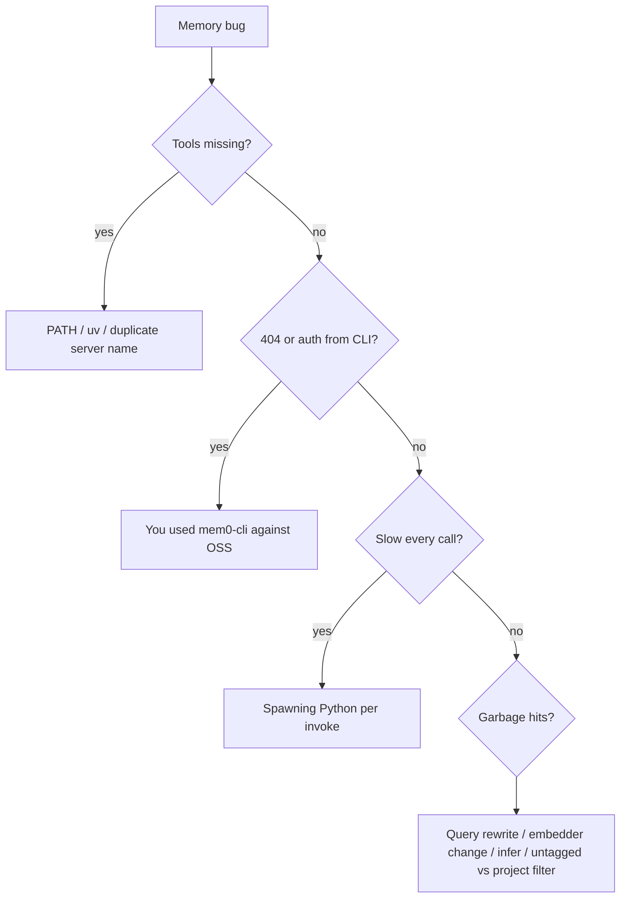

# Footguns

Things that look reasonable and then waste an afternoon.

## Secrets in MCP host config

The [README template](../README.md#mcp-registration) contains `"OPENAI_API_KEY": "sk-..."`. The host sends whatever you put in its config (e.g. `~/.cursor/mcp.json` for Cursor) to the child process. A real key in a git remote is a rotation event.

Prefer `env` that inherits from the shell the host was launched from, or a local untracked override. Never commit a live key.

## `MEM0_BASE_URL=http://localhost:8888` with `mem0-cli`

The env var exists. It retargets the **Platform** HTTP client. OSS REST is `POST /memories` + `X-API-Key`. The CLI calls `POST /v3/memories/add/` + `Authorization: Token`. You get 404s and auth failures, not local OSS.

mem0-lite does not speak that CLI. Use MCP tools or the SDK.

## Embedding `Memory()` in the agent loop

There is no user-controlled long-lived Python VM inside the agent loop. Option A from the SDK docs is for *your* process. For a hosted agent, the analogue is this MCP server (or shell+curl to a daemon).

## CLI or `uv run` per tool call

```text
# agent hot path — do not do this
run_terminal_cmd: uv run python -c "from mem0 import Memory; Memory().add(...)"
```

That re-imports `mem0ai`, reopens Qdrant, and often re-inits embeddings on every add/search. Back-to-back agent calls will feel like a hang. The MCP process exists so this does not happen.

## Default Qdrant path of `/tmp/qdrant`

Upstream `Memory()` defaults there. `/tmp` is wiped on reboot on many Macs. This wrapper sets `~/.mem0/qdrant` with `on_disk=True`. If you construct `Memory()` yourself in a scratch script, you will not get that path.

Everything lives under `~/.mem0/` (`qdrant/`, `history.db`, `config.json`, `lite.lock`, `lite.want`). Back up that directory if you care. If you had data in the old `~/.mem0-lite/` path, move `qdrant/` into `~/.mem0/`.

## Two MCP processes, same `MEM0_DIR`

Embedded Qdrant cannot share a folder. The holder keeps it open; a waiter writes `lite.want` and blocks on `lite.lock` until the holder yields ([D10](decisions.md#d10--keep-open-embedded-qdrant--cooperative-yield-no-store-daemon)). Timeout → `{"error": "store_busy"}`. Long `infer=true` holds the lock for the LLM call. Do not start a Qdrant/mem0 daemon to “fix” this.

## `search(..., user_id="x")` instead of `filters=`

OSS `add()` takes top-level `user_id`. `search()` and `get_all()` raise if you pass it that way. The wrapper always uses `filters={"user_id": ...}`. Raw SDK callers trip on this constantly.

## `memory_type="decision"` on `add()`

SDK `memory_type` only accepts procedural memory. Types like `decision` belong in `metadata`. The MCP tool parameter `memory_type` is mapped to metadata on purpose. Calling the SDK like the tool will throw.

## `infer=true` on already-extracted facts

The attach protocol writes third-person facts. If infer is on, Mem0 may split, drop rationale, or merge with unrelated neighbors. Default is off. Only enable infer for raw dialogue dumps.

## Raw user utterance as `search_memories` query

Vector search matches stored facts (“User prefers pnpm in TypeScript packages”), not chat (“can you remind me how we install stuff?”). Rewrite to 3–6 keywords. Empty or generic queries return noise; the model then “recalls” junk.

## Assuming MCP is running when tools are missing

If `uv` is not on the PATH the host sees (GUI apps on macOS often have a thin PATH), the server never starts. Launch the host from a terminal once, or use an absolute path to `uv`.

First tool call pays for `Memory.from_config` (imports, Qdrant, possibly model checks). Subsequent calls in the same session are cheap. Do not benchmark the first search.

## Two MCP servers both named `mem0`

Hosted `mcp.mem0.ai` plus mem0-lite with the same server key duplicates tools and confuses routing. Use distinct names (`mem0` vs `mem0-lite`).

## Ollama without embedder config

Setting only `MEM0_LITE_LLM_PROVIDER=ollama` leaves the OpenAI embedder in place unless you also set `MEM0_LITE_EMBEDDER_PROVIDER`. Mixed providers work; mixed *dimensions* after a switch do not. Changing embedder models without a new collection (or wipe) yields silent garbage retrieval.

## `delete_all_memories` without reading the confirm flag

The tool no-ops unless `confirm=true`. If the model keeps retrying, check the JSON error. Scope is `user_id` (+ `agent_id` if set); it is not “this repo only” unless you scoped writes that way.

## Treating list as search

`list_memories` is recency/filter dump. Semantic questions go through `search_memories`. Mixing them in the attach protocol produces either token blowups or misses.

## `cwd` outside git roots

If `MEM0_LITE_GIT_ROOTS` is set, the git toplevel must sit under one of those paths. `cwd=/` is refused. Search still runs without inferred project filters (`warning` + `follow_up`). Add writes untagged (or with explicit tags) and does not invent `project` from a local path.

## Agent `cwd` in `shell=True`

Plugins that interpolate `cwd` into a shell are a confused deputy. The bundled git plugin uses argv lists only. Do not copy `os.system(f"git -C {cwd} …")`.

## Auto-loading plugins from the workspace

Only `$MEM0_DIR/plugins/<name>/` (default `~/.mem0/plugins/<name>/`) is scanned. Bundled source in the repo checkout is not auto-loaded until linked there (`just setup`). A plugin dir in the workspace the agent opened is not loaded from `cwd`. Loading that would execute whoever owns the checkout.

## Git fetch / gh hanging on auth

Background git/`gh` set `GIT_TERMINAL_PROMPT=0` and `GH_PROMPT_DISABLED=1`. If a custom plugin omits those, a 401 waits on a TTY the MCP does not have. Auth → skip, no retry.

## `update_memory` text-only leaving stale `scope`

Promotion is a metadata patch (`scope: standing`). Text-only update leaves `wip` in place. Pass `metadata_json`.

## Holding `lite.lock` across plugin network I/O

The core runner runs plugin I/O outside `memory_session()`. A plugin that opens the store itself and then `git fetch` wedges other MCP processes on that `MEM0_DIR` ([D10](decisions.md#d10--keep-open-embedded-qdrant--cooperative-yield-no-store-daemon)).

## Import-on-start side effects

Plugin modules are imported when first loaded. A plugin that talks to the network or the store at import time delays or breaks MCP startup. Keep import side-effect free. A broken import is skipped (logged), not a process crash.

## Dumping git status into the store

The official git plugin never `add_memory` from probe output. A custom plugin can; that is noise you then have to delete.

## Disabling git and expecting `cwd` to stamp tags

`MEM0_LITE_PLUGINS_DISABLE=git` (or a missing git binary) means `cwd` is ignored for stamping. Pass `project` / `workstream` explicitly.

## Optional tagged-store wipe

New filters do not migrate old payloads. Untagged memories remain valid and show up only in unfiltered search. If you want every record tagged, stop MCP hosts then:

```bash
just wipe
# or: rm -rf ~/.mem0
# or: rm -rf "$MEM0_DIR"
```

That directory is Qdrant, `history.db`, locks, and logs. Not done automatically. `just wipe` asks to confirm.


