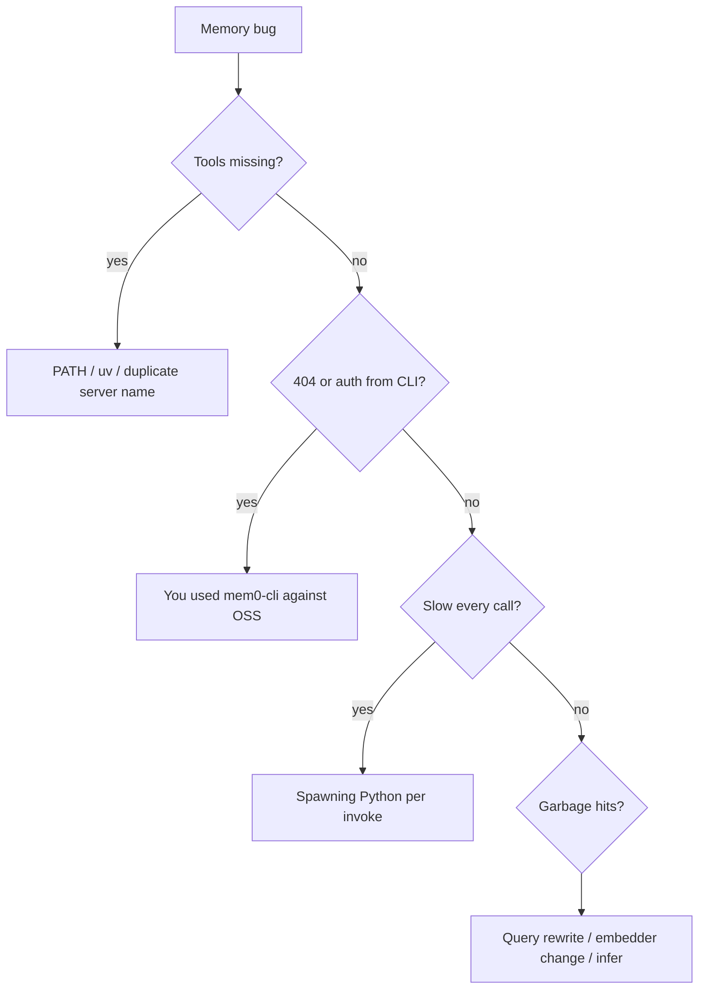

# Footguns

Things that look reasonable and then waste an afternoon.

## Secrets in `mcp.json`

The template contains `"OPENAI_API_KEY": "sk-..."`. Cursor will send whatever you put there to the child process. A real key in a git remote is a rotation event.

Prefer `env` that inherits from the shell Cursor was launched from, or a local untracked override. Never commit a live key.

## `MEM0_BASE_URL=http://localhost:8888` with `mem0-cli`

The env var exists. It retargets the **Platform** HTTP client. OSS REST is `POST /memories` + `X-API-Key`. The CLI calls `POST /v3/memories/add/` + `Authorization: Token`. You get 404s and auth failures, not local OSS.

mem0-lite does not speak that CLI. Use MCP tools or the SDK.

## Embedding `Memory()` in “the Cursor agent”

There is no user-controlled long-lived Python VM inside the agent loop. Option A from the SDK docs is for *your* process. In Cursor, the analogue is this MCP server (or shell+curl to a daemon).

## CLI or `uv run` per tool call

```text
# agent hot path — do not do this
run_terminal_cmd: uv run python -c "from mem0 import Memory; Memory().add(...)"
```

That re-imports `mem0ai`, reopens Qdrant, and often re-inits embeddings on every add/search. Back-to-back agent calls will feel like a hang. The MCP process exists so this does not happen.

## Default Qdrant path of `/tmp/qdrant`

Upstream `Memory()` defaults there. `/tmp` is wiped on reboot on many Macs. This wrapper sets `~/.mem0-lite/qdrant` with `on_disk=True`. If you construct `Memory()` yourself in a scratch script, you will not get that path.

History still defaults to `~/.mem0/history.db` (mem0ai), which is a different directory than the vectors. Back up both if you care.

## `search(..., user_id="x")` instead of `filters=`

OSS `add()` takes top-level `user_id`. `search()` and `get_all()` raise if you pass it that way. The wrapper always uses `filters={"user_id": ...}`. Raw SDK callers trip on this constantly.

## `memory_type="decision"` on `add()`

SDK `memory_type` only accepts procedural memory. Types like `decision` belong in `metadata`. The MCP tool parameter `memory_type` is mapped to metadata on purpose. Calling the SDK like the tool will throw.

## `infer=true` on already-extracted facts

The attach protocol writes third-person facts. If infer is on, Mem0 may split, drop rationale, or merge with unrelated neighbors. Default is off. Only enable infer for raw dialogue dumps.

## Raw user utterance as `search_memories` query

Vector search matches stored facts (“User prefers pnpm in TypeScript packages”), not chat (“can you remind me how we install stuff?”). Rewrite to 3–6 keywords. Empty or generic queries return noise; the model then “recalls” junk.

## Assuming MCP is running when tools are missing

If `uv` is not on the PATH Cursor sees (GUI apps on macOS often have a thin PATH), the server never starts. Launch Cursor from a terminal once, or use an absolute path to `uv`.

First tool call pays for `Memory.from_config` (imports, Qdrant, possibly model checks). Subsequent calls in the same session are cheap. Do not benchmark the first search.

## Two MCP servers both named `mem0`

Hosted `mcp.mem0.ai` plus mem0-lite with the same server key duplicates tools and confuses routing. Use distinct names (`mem0` vs `mem0-lite`).

## Ollama without embedder config

Setting only `MEM0_LITE_LLM_PROVIDER=ollama` leaves the OpenAI embedder in place unless you also set `MEM0_LITE_EMBEDDER_PROVIDER`. Mixed providers work; mixed *dimensions* after a switch do not. Changing embedder models without a new collection (or wipe) yields silent garbage retrieval.

## `delete_all_memories` without reading the confirm flag

The tool no-ops unless `confirm=true`. If the model keeps retrying, check the JSON error. Scope is `user_id` (+ `agent_id` if set); it is not “this repo only” unless you scoped writes that way.

## Treating list as search

`list_memories` is recency/filter dump. Semantic questions go through `search_memories`. Mixing them in the attach protocol produces either token blowups or misses.


